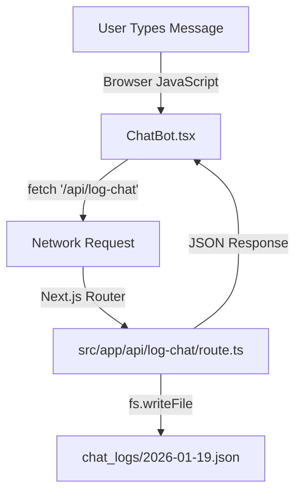

# In-Depth Developer Guide for `lepondy-cheese-site`

Welcome to your Next.js project! This guide assumes zero prior knowledge of Next.js and explains exactly how your specific project is set up.

---

## 1. Where does the project start?

Your project uses the modern **Next.js App Router**.

*   **Entry Point:** The "root" of your application is `src/app/layout.tsx`.
    *   This file is a "wrapper" that wraps around *every single page* in your site.
    *   It holds common elements like the `<Header />`, `<Footer />`, `<ChatBot />`, and the `<CartProvider />`.
    *   If you add a script tag or a font here, it applies to the entire website.

*   **The Home Page:** The main landing page is `src/app/page.tsx`.
    *   When you visit `http://localhost:3000/`, Next.js renders this file.

## 2. How Routing Works

In the App Router, **folders define routes**.

*   **Directory Structure = URL Path:**
    *   `src/app/page.tsx` → `lepondicheese.com/` (Home)
    *   `src/app/shop/page.tsx` → `lepondicheese.com/shop`
    *   `src/app/contact/page.tsx` → `lepondicheese.com/contact`
    *   `src/app/products/[id]/page.tsx` → `lepondicheese.com/products/baby-swiss` (Dynamic Route)

*   **How pages are rendered:**
    *   By default, pages in `src/app` are **Server Components**. They are rendered on the server (backend) first, and then sent as HTML to the browser.
    *   If a file has `'use client'` at the very top (like `src/components/ChatBot.tsx`), it is a **Client Component**, meaning it can use interactivity (onClick, useState, etc.).

## 3. Data & Database: "The Hidden Truth"

**Q: Is a database connected?**
**A: NO.**

Your project currently **DOES NOT** use a traditional database like SQL or MongoDB. Instead, it uses two simple methods:

1.  **Read-Only Data (Mock DB):**
    *   Product data is stored in a simple TypeScript file: `src/data/products.ts`.
    *   When the app needs products, it just imports this array directly.
2.  **Write-Only Data (Flat Files):**
    *   Chat logs are saved directly to JSON files in a folder named `chat_logs/` in your project root.
    *   This is handled by the API route `src/app/api/log-chat/route.ts`.

**How to identify the DB configuration?**
There is none! You won't find `db.ts` or `prisma`. All your data logic is currently "hardcoded" or file-based.

## 4. API Routes & Status Codes

**Q: Where are API routes defined?**
**A:** In the `src/app/api` folder.
Just like pages, folders create the URL path, but the file must be named `route.ts`.

*   `src/app/api/send-email/route.ts` → Listens for POST requests at `/api/send-email`
*   `src/app/api/log-chat/route.ts` → Listens for POST requests at `/api/log-chat`

**Q: Why do I see status codes in the terminal?**
When you run `npm run dev`, your terminal manages both the **Frontend** (React) and the **Backend** (API Routes).
*   **Green (200 OK):** Your `ChatBot` component successfully called an API (e.g., logged a chat).
*   **Red (500 Error):** Something crashed on the server (e.g., missing API key).
*   **Yellow (404 Not Found):** The browser tried to fetch something that doesn't exist.

## 5. The Full Request Flow

Here is the path data takes when a user interacts with your ChatBot:



## 6. Environment Variables

Your project has a `.env.local` file in the root. This is where secrets live.
*   **Current Config:**
    *   `RESEND_API_KEY`: A real API key used by the `send-email` route to send emails via Resend.com.
    *   **Safeguard:** If you delete this file, the email feature will break, but the rest of the site will work.

## 7. How to Safely Modify...

### **A. Adding a New Page**
1.  Create a new folder in `src/app`, e.g., `src/app/events`.
2.  Create a file inside it named `page.tsx`.
3.  Add the code:
    ```tsx
    export default function EventsPage() {
      return <h1>Upcoming Cheese Events</h1>;
    }
    ```
4.  Visit `localhost:3000/events`. Next.js handles the rest.

### **B. Adding a New API Endpoint**
1.  Create a folder in `src/app/api`, e.g., `src/app/api/subscribe`.
2.  Create `route.ts` inside it.
3.  Add the code:
    ```ts
    import { NextResponse } from 'next/server';

    export async function POST(request: Request) {
        const body = await request.json();
        console.log("New subscriber:", body.email);
        return NextResponse.json({ success: true });
    }
    ```

### **C. Modifying a DB Query (Currently: Modifying Data)**
Since you don't have a real DB, you verify data by editing files.
*   **To change a product price:**
    *   Open `src/data/products.ts`.
    *   Find the product.
    *   Change `price: 320` to `price: 350`.
    *   Save. The site updates instantly.

## 8. Mental Model Checklist

Before debugging, ask yourself these 3 questions:

1.  **Where am I?**
    *   `app/page.tsx` = Server Side (Node.js world, can't use window/alert).
    *   `'use client'` file = Client Side (Browser world, can use onClick).

2.  **Is this a Page or an API?**
    *   `page.tsx` returns HTML (UI).
    *   `route.ts` returns JSON (Data).

3.  **Where is the data coming from?**
    *   For this project: It's mostly coming from the `src/data` folder.
    *   If data seems "stuck" or wrong, check `products.ts` first.
